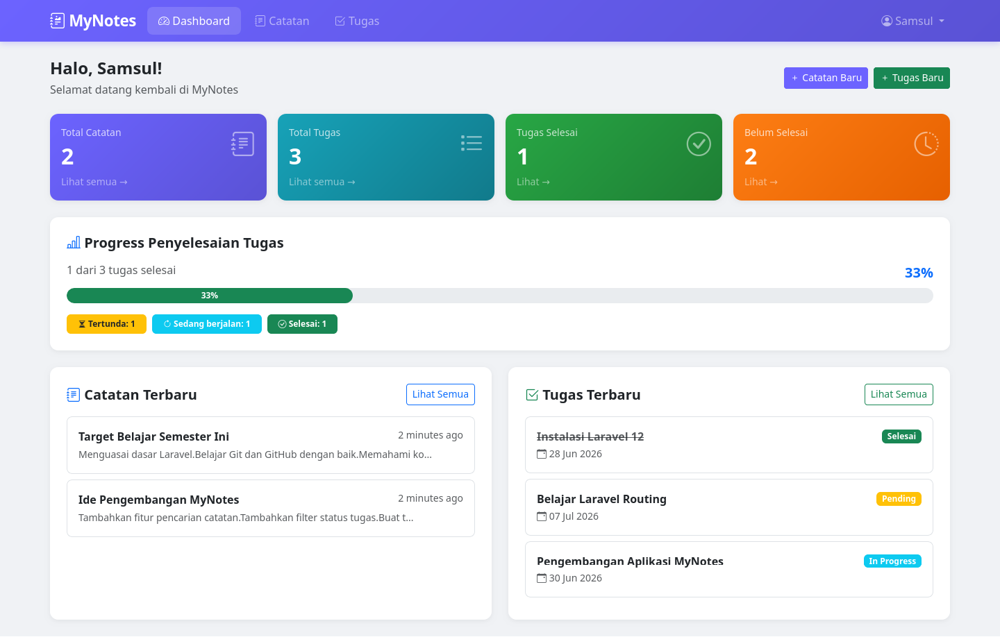
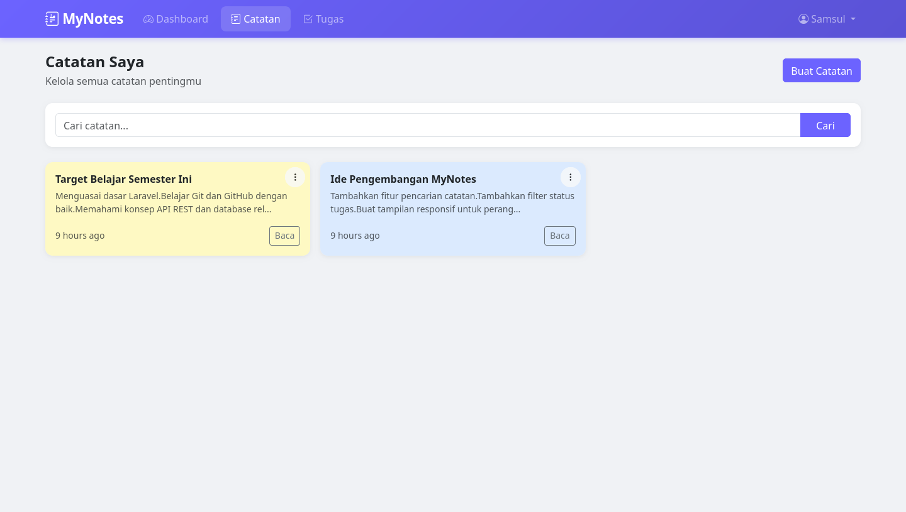
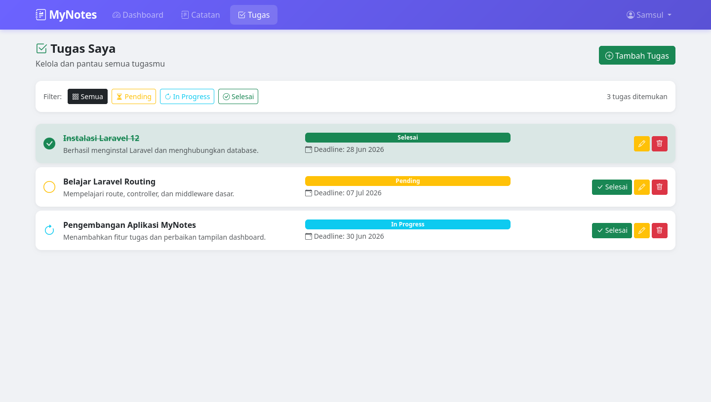

# 📝 MyNotes

MyNotes adalah aplikasi web sederhana berbasis Laravel untuk mengelola catatan dan tugas harian. Pengguna dapat membuat, mengedit, mencari, dan menghapus catatan maupun tugas dengan antarmuka yang modern dan responsif.

## ✨ Fitur Utama

### 📒 Manajemen Catatan
- Tambah catatan baru
- Edit catatan
- Hapus catatan
- Pencarian catatan berdasarkan judul atau isi
- Menampilkan daftar catatan terbaru

### ✅ Manajemen Tugas
- Tambah tugas baru
- Edit tugas
- Hapus tugas
- Status tugas:
  - Pending
  - In Progress
  - Selesai
- Filter tugas berdasarkan status
- Deadline tugas (opsional)

### 📊 Dashboard
- Statistik total catatan
- Statistik total tugas
- Jumlah tugas selesai
- Jumlah tugas belum selesai
- Progress penyelesaian tugas
- Ringkasan catatan dan tugas terbaru

### 👤 Autentikasi Pengguna
- Registrasi akun
- Login
- Logout
- Data catatan dan tugas terpisah untuk setiap pengguna

---

## 🖼️ Tampilan Aplikasi

### Dashboard



### Halaman Catatan



### Form Tambah Catatan


### Halaman Tugas



### Form Tambah Tugas


---

## 🛠️ Teknologi yang Digunakan

- Laravel
- PHP
- MySQL
- Bootstrap 5
- Blade Template Engine
- Font Awesome

---

## 📦 Instalasi

### 1. Clone Repository

```bash
git clone https://github.com/username/mynotes.git
cd mynotes
```

### 2. Install Dependency

```bash
composer install
```

### 3. Salin File Environment

```bash
cp .env.example .env
```

### 4. Generate Application Key

```bash
php artisan key:generate
```

### 5. Konfigurasi Database

Edit file `.env`

```env
DB_CONNECTION=mysql
DB_HOST=127.0.0.1
DB_PORT=3306
DB_DATABASE=mynotes
DB_USERNAME=root
DB_PASSWORD=
```

### 6. Jalankan Migrasi

```bash
php artisan migrate
```

### 7. Jalankan Server

```bash
php artisan serve
```

Aplikasi dapat diakses melalui:

```text
http://127.0.0.1:8000
```

---

## 📂 Struktur Fitur

```
app/
├── Models/
│   ├── Note.php
│   ├── Task.php
│   └── User.php
│
├── Http/
│   └── Controllers/
│       ├── DashboardController.php
│       ├── NoteController.php
│       └── TaskController.php
│
resources/
└── views/
    ├── dashboard/
    ├── notes/
    ├── tasks/
    └── layouts/
```

---

## 🚀 Penggunaan

### Membuat Catatan
1. Login ke aplikasi
2. Klik menu **Catatan**
3. Klik **Buat Catatan**
4. Isi judul dan isi catatan
5. Klik **Simpan Catatan**

### Membuat Tugas
1. Klik menu **Tugas**
2. Klik **Tambah Tugas**
3. Isi nama tugas
4. Pilih status tugas
5. Tentukan deadline (opsional)
6. Klik **Simpan Tugas**

---

## 🎯 Tujuan Project

Project ini dibuat sebagai media pembelajaran dan implementasi:

- Laravel MVC
- Authentication Laravel
- CRUD (Create, Read, Update, Delete)
- Relasi Database
- Query Builder & Eloquent ORM
- Dashboard Statistik
- UI Responsif

---

## 👨‍💻 Developer

**Izza Adian Ahmad**

Mahasiswa Teknologi Informasi yang sedang belajar pengembangan aplikasi web menggunakan Laravel.

---

## 📄 Lisensi

Project ini dibuat untuk kebutuhan pembelajaran dan pengembangan pribadi.