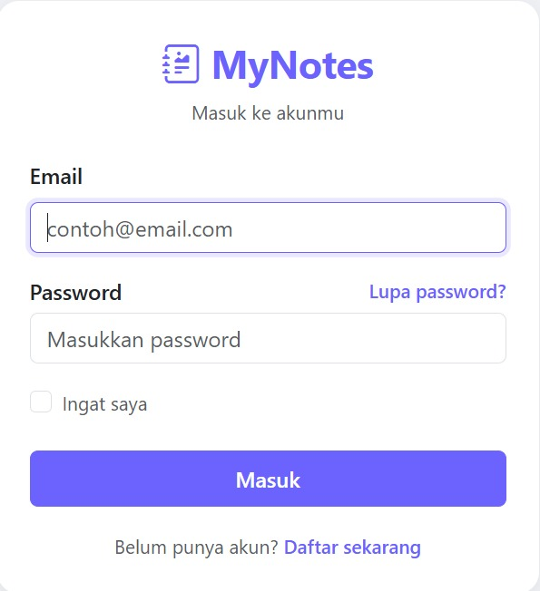
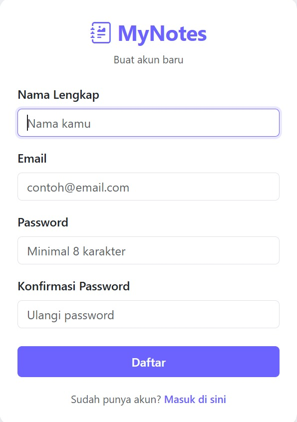
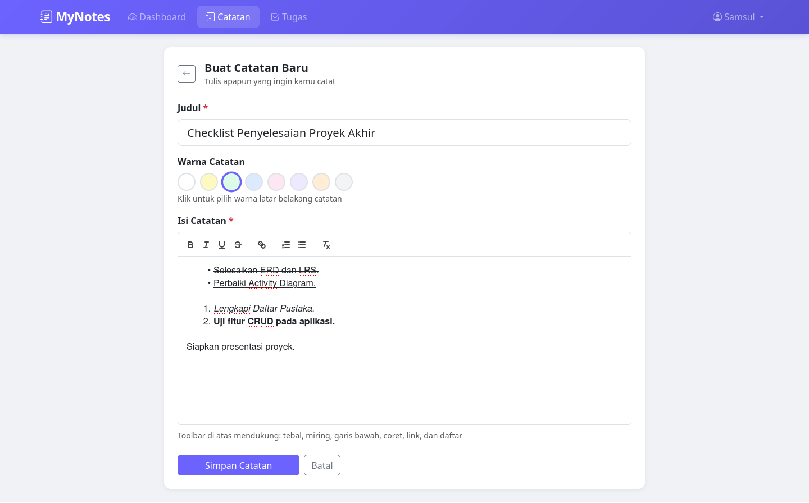
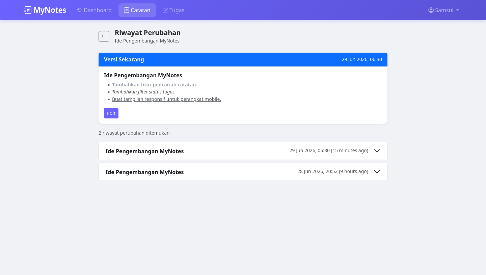

<div align="center">


<br><br>

# 📝 MyNotes

**Satu aplikasi untuk semua kebutuhanmu — catat ide, kelola tugas, pantau progress.**
Modern · Personal · Dibangun dengan Laravel

<br>

[](https://mynotes-production-1cc5.up.railway.app)

<br>


</div>

---

## ✨ Fitur Utama

| Modul | Fitur |
|---|---|
| 📒 **Catatan** | CRUD lengkap · 8 pilihan warna catatan · Editor rich text (bold, italic, underline, list, link) · Pencarian judul/isi · **Riwayat perubahan catatan** |
| ✅ **Tugas** | CRUD lengkap · Status Tertunda / Sedang Berjalan / Selesai · Filter status · Deadline dengan indikator otomatis · Tandai selesai sekali klik |
| 📊 **Dashboard** | Statistik catatan & tugas real-time · Progress bar penyelesaian tugas · Daftar aktivitas terbaru |
| 🔐 **Autentikasi** | Login & registrasi dengan tampilan kustom · Proteksi data antar pengguna · Logout aman |

---

## 🌐 Demo Online

Aplikasi sudah dapat diakses secara publik tanpa perlu instalasi:

👉 **https://mynotes-production-1cc5.up.railway.app**

> Silakan daftar akun baru untuk mencoba semua fitur.

---

## 🖼️ Tampilan Aplikasi

<div align="center">

| Login | Register |
|:---:|:---:|
|  |  |

| Dashboard |
|:---:|
|  |

| Catatan Saya | Tugas Saya |
|:---:|:---:|
|  |  |

| Buat Catatan | Riwayat Catatan |
|:---:|:---:|
|  |  |

</div>

---

## 🆕 Yang Baru

- 🎨 **Warna Catatan** — bedakan catatan dengan 8 pilihan warna latar belakang
- ✍️ **Rich Text Editor** — format teks dengan bold, italic, underline, strikethrough, link, dan list
- 🕓 **Riwayat Perubahan** — setiap edit catatan otomatis tersimpan, bisa dilihat kapan saja
- 💜 **Tampilan Auth Kustom** — halaman login & register bertema ungu MyNotes, bukan lagi default Laravel
- 🚀 **Online & Dapat Diakses Publik** — di-deploy di Railway

---

## 🛠️ Teknologi

| Layer | Stack |
|---|---|
| Backend | Laravel 11 (PHP 8.x) |
| Database | MySQL |
| Frontend | Bootstrap 5 · Blade Template Engine |
| Editor | Quill.js (Rich Text Editor) |
| Tanggal | Carbon |
| Hosting | Railway |

---

## 📦 Instalasi Lokal

### Prasyarat

```
PHP >= 8.2     Composer     MySQL     Node.js >= 20
```

### Langkah-langkah

**1. Clone repository**
```bash
git clone https://github.com/username/mynotes.git
cd mynotes
```

**2. Install dependency PHP & JS**
```bash
composer install
npm install
```

**3. Salin file environment**
```bash
cp .env.example .env
php artisan key:generate
```

**4. Konfigurasi database** — edit file `.env`:
```env
DB_CONNECTION=mysql
DB_HOST=127.0.0.1
DB_PORT=3306
DB_DATABASE=mynotes
DB_USERNAME=root
DB_PASSWORD=
```

**5. Jalankan migrasi**
```bash
php artisan migrate
```

**6. Build asset & jalankan server**
```bash
npm run build
php artisan serve
```

Buka aplikasi di **http://127.0.0.1:8000** 🎉

---

## 🚀 Cara Penggunaan

<details>
<summary><strong>📒 Membuat & Mengedit Catatan</strong></summary>

1. Login ke aplikasi
2. Klik menu **Catatan** → **Buat Catatan**
3. Isi judul, pilih warna catatan, tulis isi menggunakan editor
4. Klik **Simpan Catatan**
5. Setiap kali catatan diedit, versi sebelumnya otomatis tersimpan ke **Riwayat**

</details>

<details>
<summary><strong>🕓 Melihat Riwayat Catatan</strong></summary>

1. Buka detail catatan yang sudah pernah diedit
2. Klik tombol **Riwayat**
3. Lihat seluruh versi lama catatan dalam tampilan accordion

</details>

<details>
<summary><strong>✅ Mengelola Tugas</strong></summary>

1. Klik menu **Tugas** → **Tambah Tugas**
2. Isi nama tugas, deskripsi (opsional), deadline (opsional), dan status
3. Klik **Simpan Tugas**
4. Gunakan tombol **Selesai** untuk menandai tugas selesai dengan cepat
5. Gunakan filter status untuk menyaring daftar tugas

</details>

---

## 📂 Struktur Proyek

```
app/
├── Models/
│   ├── Note.php
│   ├── NoteHistory.php
│   ├── Task.php
│   └── User.php
│
└── Http/Controllers/
    ├── DashboardController.php
    ├── NoteController.php
    └── TaskController.php

resources/views/
├── dashboard.blade.php
├── notes/
│   ├── index.blade.php
│   ├── create.blade.php
│   ├── edit.blade.php
│   ├── show.blade.php
│   └── history.blade.php
├── tasks/
├── auth/
│   ├── login.blade.php
│   └── register.blade.php
└── layouts/
    ├── app.blade.php
    └── guest.blade.php
```

---

## 🗄️ Skema Database

```
users ──┬──< notes ──< note_histories
        └──< tasks
```

| Tabel | Keterangan |
|---|---|
| `users` | Data akun pengguna |
| `notes` | Catatan pengguna (judul, isi HTML, warna) |
| `note_histories` | Riwayat versi lama tiap catatan |
| `tasks` | Tugas pengguna (judul, deskripsi, deadline, status) |

---

## 🎯 Tujuan Pembelajaran

Project ini dibuat sebagai implementasi nyata dari:

- ✅ Laravel MVC Architecture
- ✅ Authentication & Authorization (ownership check)
- ✅ CRUD — Create, Read, Update, Delete
- ✅ Relasi Database — One to Many
- ✅ Eloquent ORM & Query Builder
- ✅ Rich Text Editor Integration (Quill.js)
- ✅ Dashboard Statistik Real-time
- ✅ UI Responsif dengan Bootstrap 5
- ✅ Deploy ke production server (Railway)

---

## 👨‍💻 Tim Pengembang

| Nama | NIM |
|---|---|
| Izza Adian Ahmad | 17240664 |
| Chandra Adian Ahmad | 17240663 |
| Rahmat Hidayat Ramadhan | 17240354 |
| M. Azhari Nuswantoro | 17240565 |
| Gabriella Zefanya | 17240609 |
| Alvin Pranata | 17240625 |

**Program Studi Teknologi Informasi**
Fakultas Teknik dan Informatika — Universitas Bina Sarana Informatika

---

## 📄 Lisensi

Project ini dibuat untuk kebutuhan pembelajaran mata kuliah Web Programming 2.

<div align="center">

Made with 💜 using Laravel · Hosted on Railway

</div>
